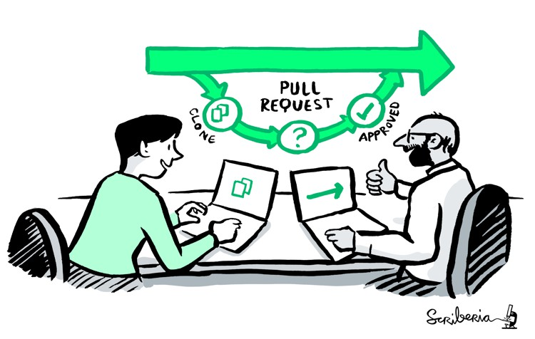

  

# Code Review Training and Education
This repository is created by the **"Code review Training and Education"** task group, which is part of the **"Code Review Community Working Group"**.

Code review for research software is the process by which a peer evaluates another’s code – checking that the code does what it claims and is written in a way that can easily be read, maintained, and built upon by others. Code review is intended to improve code quality and reusability, whilst ensuring good practises and providing a learning opportunity for both parties. Code review may take place at different points throughout the research software lifecycle, and the code review process may vary depending on when the code is reviewed and the type of code being reviewed.  As a means of quality assurance, code review lends to trustworthiness.

## Mandate
- Identify and address barriers to code review, for all parties involved 
- Identify existing resources to support code review 
- Support the practical implementation of the outputs produced by each task group in the Code Review Community Working Group- with an aim to increase awareness and build capacity for code review. Materials for different audiences examples:
  - Infographic on code review for PIs
  - How to guide for code review
  - Community building (champions as a first step)
- Responsible for reaching out to related initiatives to collaborate on skills development.
 
 
### Phase 1 objectives (3 - 6 months)
- Identify and address barriers to code review, for all parties involved 
- Identify existing resources to support code review 

> The image above is taken from the Turing Way project illustration by Scriberia. Zenodo. http://doi.org/10.5281/zenodo.3332807¶
